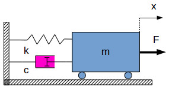

# What is a state space model 

State-space system representation lays the foundations for modern control theory.
It solves many of the limitations of the classical control theory in which **transfer functions** were used to asses the behavior of a closed loop system.

A state-space model describes the behavior of a dynamic system as a set of first order ordinary differential equations (ODE). If a dynamic model is described by a higher order ODE, using state-space, the same model can be described as a set of coupled first order ODEs. The internal variables of the state-space model are called state variables and they fully describe the dynamic system and its response for certain inputs.

A state-space model is formed by:
+ state equations
+ output equations

# System used

